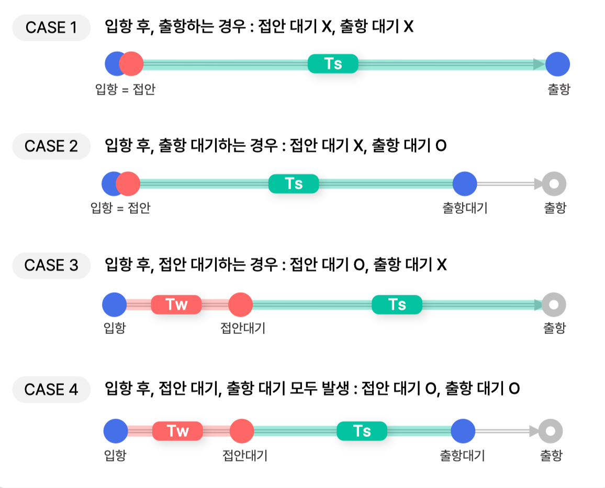
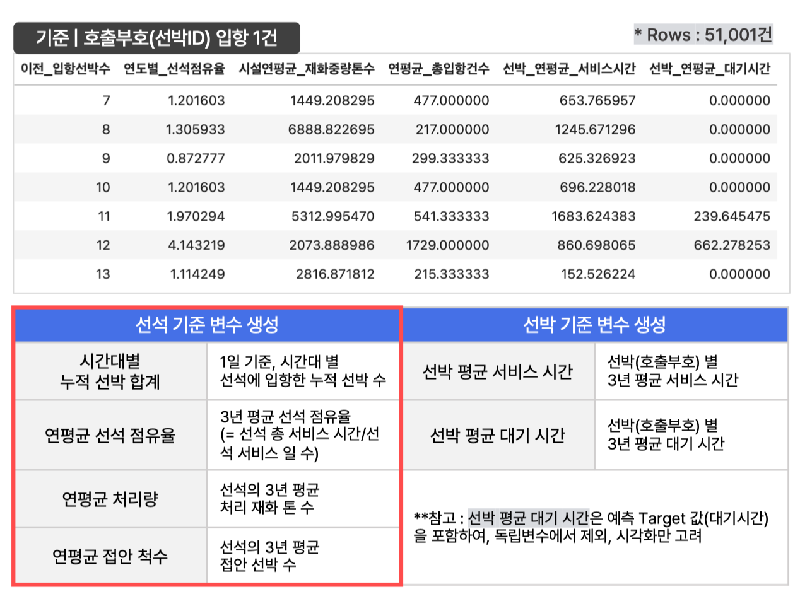
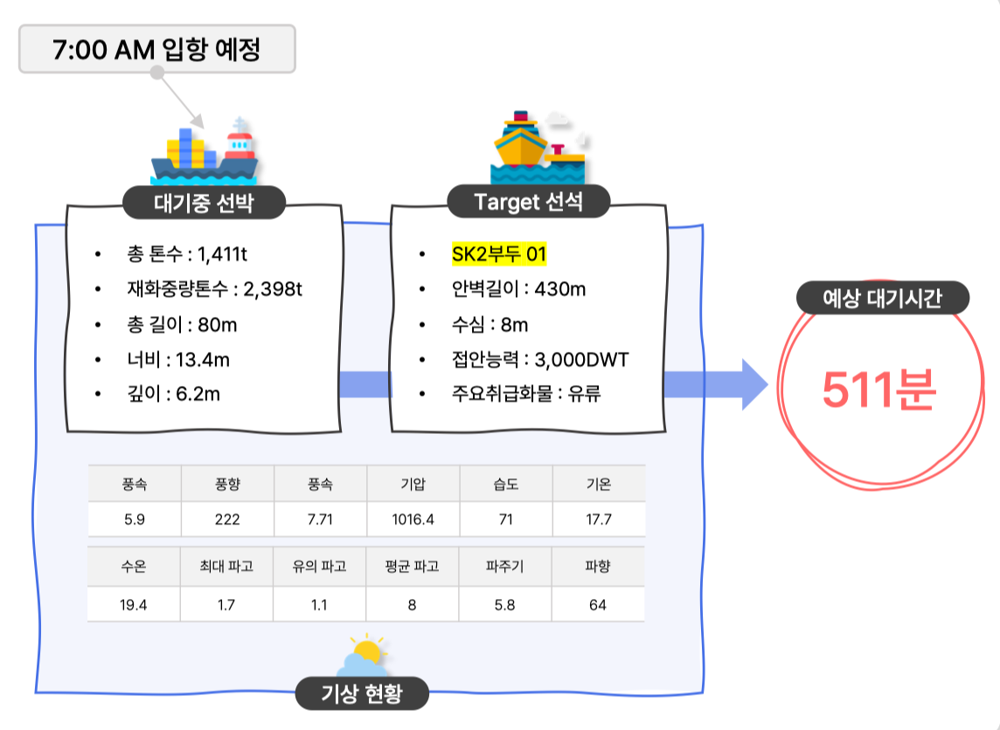
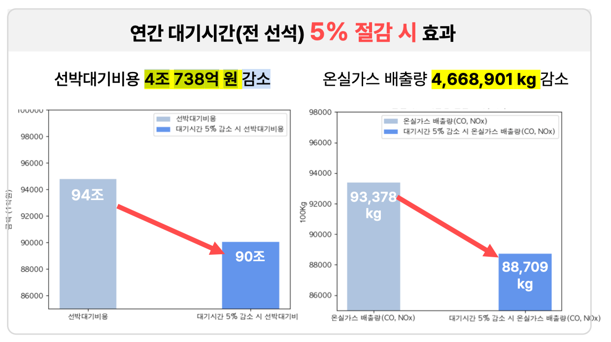
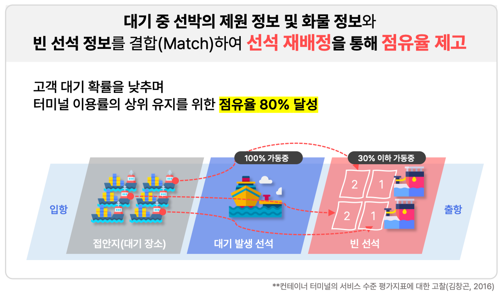

# Vessel_ETA_PJT

### ⛴️ 항만 선박 대기시간 예측 및 운영 시스템 개선 제안

---

- 주제 선정 배경 : 항만 서비스의 핵심 지표인 '선박 대기시간' 감소를 위한 '분' 단위 명확한 대기시간 예측으로 물류 비용 절감 및 항구 경쟁력 증대, 대기 오염 감소 효과를 기대
- 데이터 : PORT-MIS 선박 입출항 현황, 시설사용허가현황, 울산항 선박제원정보, 해양기상정보
- 결과 : 울산항 선박 대기시간 '분' 단위 예측 모델 & 울산항 선석 점유율 개선 방안 제안
  - lightGBM 회귀 모델
  - 순작업시간 점유율 하위 선석 - 대기 선박 매칭 방안 제안
- 기대효과 : 선박 운영 비용 감소, 대기오염 배출량 감소

### Requirements

### 분석 프로세스

1. 1차 데이터 수집 및 전처리 ▶︎ 후보 항만 대기율 도출
2. target 항만(울산항) 2차 데이터 수집 및 전처리 
3. 울산항 데이터 EDA & Feature Engineering
4. 울산항 액체화물 선박 '분' 단위 대기시간 예측 모델링
5. 예측 결과 활용 예시 및 기대효과 도출
6. 항만 운영시스템 개선사항 제안

### 대기율 산출을 위한 입출항 Case 정의

- 대기율 산출 목적 : 후보 항만 중 target 항만 선정 지표로 채택
  - 선박 대기율은 항만 서비스 주요 지표로, 정확한 측정과 최적값 유지가 중요함
  - 대기율 = 대기시간 / 서비스시간

- 대기율 비교 결과 : target 항만 울산항 선정
- 입출항 Case 정의 목적 :  일반적인 8단계의 선박 입출항 프로세스 중 대기/서비스 시점에 영향을 미치는 시점 중심으로 Case 재정의

### 울산항 데이터 EDA

- 전체 입항 건 중 대기 발생 건 비율
- 선박 용도별 방문횟수 비율
- 선박 용도별 평균 대기 시간 및 대기율
- 선석(계선장소)별 평균 대기율
- 상관분석(액체/비액체 화물 구분)
- K-S 검정

### Feature Engineering

- 선석 기준 파생변수 생성 : 시간대별 누적 선박 합계, 연평균 선석 점유율, 연평균 톤 처리량, 연평균 접안 척수
- 선박 기준 파생변수 생성 : 선박 평균 서비스 시간, 선박 평균 대기 시간

### Model Fitting & Application

- CatBoost, XGBoost, LightGBM 3가지 모델 사용, RMSE 최저 모델(LGBM) 채택

- 대기시간 예측 결과 예시
  
  

### 기대효과

- 선박 대기비용 4조 738억 원 감소
- 온실가스 배출량 4,668,901kg 감소

 

### 항만 운영 시스템 개선 제안사항

- 순작업시간 점유율 30% 이하 선석(문제 선석)의 활용 방안 : 대기중 선박 정보와 문제 선석의 정보를 매칭하여 선박 대기율을 낮추고 서비스 시간을 높여 항만 운영 효율성을 제고

  